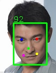

# Face Detection Project

The goal of this project is to implement face detection using pure C++. It is based on the [ShiqiYu/libfacedetection](https://github.com/ShiqiYu/libfacedetection) project and optimized and improved upon it.

## Project Features

- Written in C++17 standard, making full use of new C++17 features.
- Compiled using MinGW, compatible with the Windows platform.
- Depends on the OpenCV library for image processing and display.

## System Requirements

- C++17 compiler (MinGW recommended)
- OpenCV library (it is recommended to compile using the [huihut/OpenCV-MinGW-Build](https://github.com/huihut/OpenCV-MinGW-Build) project)

## Compilation and Running

1. Clone this repository to your local machine: `git clone https://github.com/[your_username]/Face-Detection-Project.git`
2. Change to the project directory: `cd Face-Detection-Project`
3. Modify the `CMakeLists.txt` file, setting `OpenCV_DIR` to your own OpenCV environment directory.
4. Compile the project using MinGW: `mingw32-make`
5. Run the demo: `./build/face_detection_demo.exe <path to image>`

Please note that you need to install OpenCV and compile it with MinGW before running the demo. Precompiled files can be obtained from the [huihut/OpenCV-MinGW-Build](https://github.com/huihut/OpenCV-MinGW-Build) repository.

## DEMO

